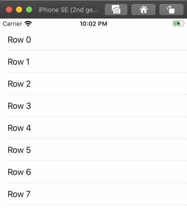

# PullToBrew

Everyone likes coffee.
What if you could brew virtual coffee while wating for some data to be transferred to your device.
That would be delicious.



## Installation

Add the Swift Package in Xcode.

## Usage

### 1) Add an instance of PullToBrewView

```swift
class TableViewController: UITableViewController {
  
  var refreshView: PullToBrewView!
  
  override func viewWillAppear(_ animated: Bool) {
    super.viewWillAppear(animated)
    
    refreshView = PullToBrewView(scrollView: tableView)
    refreshView.refreshDelegate = self
    
    tableView.addSubview(refreshView)
  }
  
  override func viewWillDisappear(_ animated: Bool) {
    super.viewWillDisappear(animated)
    
    refreshView.removeFromSuperview()
    refreshView = nil
  }
}
```

### 2) Forward scroll view delegate methods

```swift
extension TableViewController {
  override func scrollViewDidScroll(_ scrollView: UIScrollView) {
    refreshView.scrollViewDidScroll(scrollView)
  }
  
  override func scrollViewWillEndDragging(_ scrollView: UIScrollView, withVelocity velocity: CGPoint, targetContentOffset: UnsafeMutablePointer<CGPoint>) {
    refreshView.scrollViewWillEndDragging(scrollView, withVelocity: velocity, targetContentOffset: targetContentOffset)
  }
  
  override func scrollViewWillBeginDragging(_ scrollView: UIScrollView) {
    refreshView.scrollViewWillBeginDragging(scrollView)
  }
}
```

### 3) Conform to PullToBrewDelegate

```swift
extension TableViewController: PullToBrewDelegate {
  func refreshViewDidRefresh(_ refreshView: PullToBrewView) {
    // load data and call `refreshView.endRefreshing()` when loading is finished
  }
}
```

## Author

Dominik Hauser

Twitter: [@dasdom](https://twitter.com/dasdom)

## Book

[Buy my book](https://pragprog.com/titles/dhios/)

## Licence

MIT
